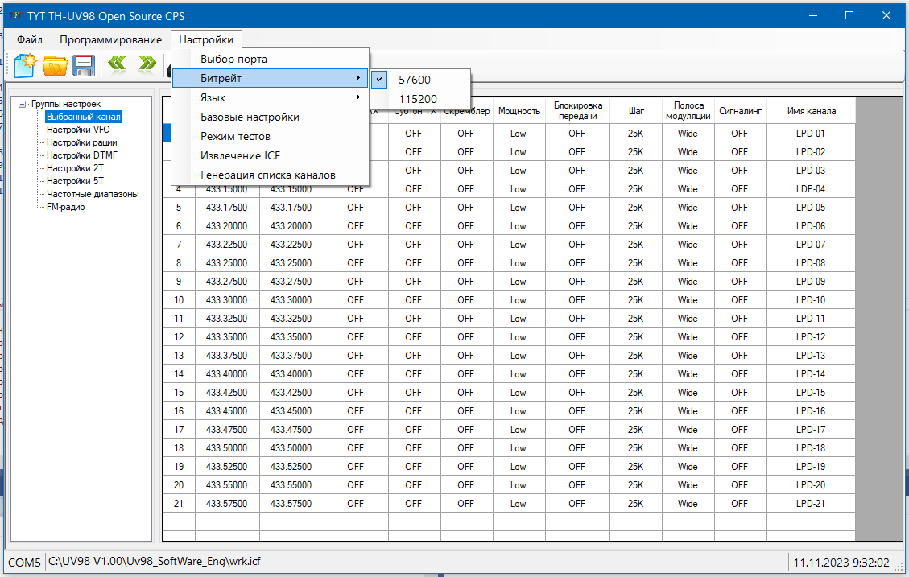

# TH-UV98 Open Source CPS
Проект основан на реверс-инжиниринге оригинальной CPS для раций TYT TH-UV98 и предназначен для вылавливания оттуда багов и чудовищных пиздецом китайского кода.  

  

# ToDo
* Замена китайского и кривого английского на русский
* Удаление ненужного и кривого кода
* Исправление сервисных меню
* Расширение функционала  

